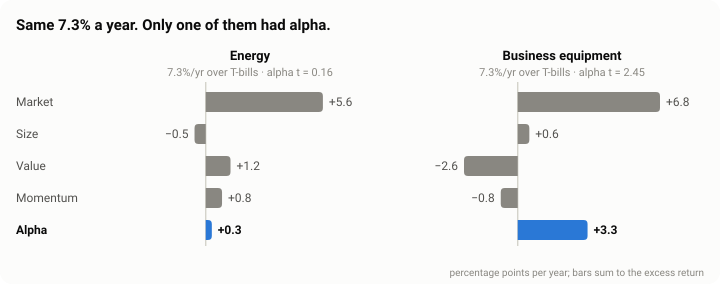
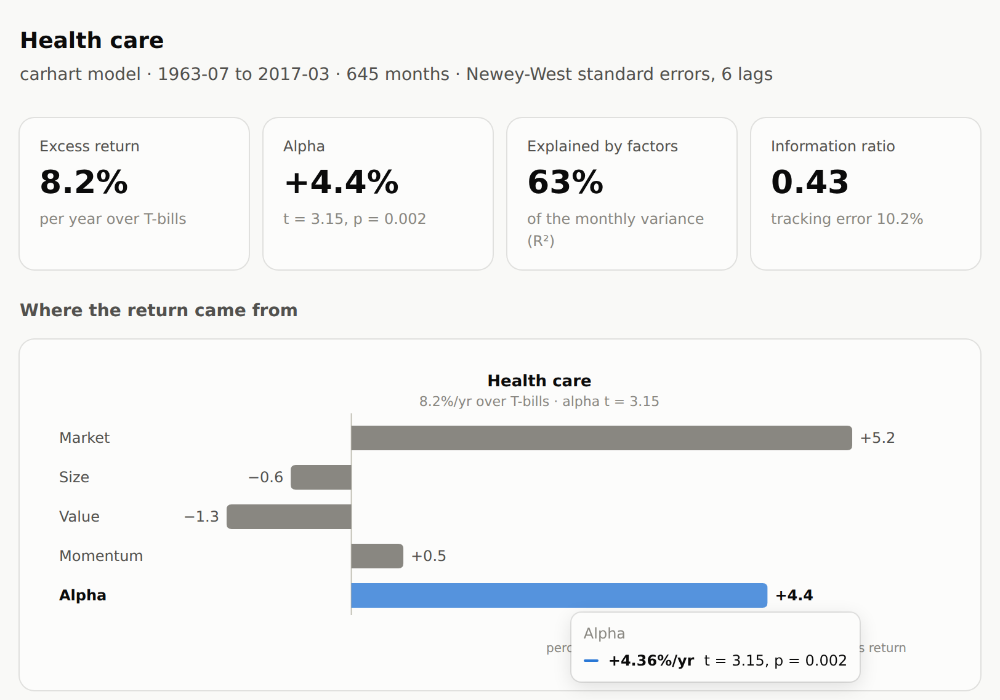
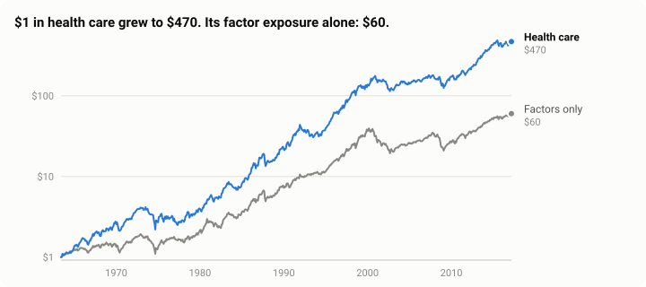

# unbundle

[](https://github.com/ZorigoKH/unbundle/actions/workflows/ci.yml)


**How much of a fund's return could you have bought for a few basis points?**

Most of any stock portfolio's return is exposure to a handful of well-known factors: the
market, small caps, value, momentum, profitability, investment. Index and factor funds sell
that exposure cheaply. What is left over, *alpha*, is the only part worth paying an active
manager for. `unbundle` splits a return series into those two parts, puts honest
(Newey–West) standard errors on every number, and tests whether the leftovers are real.

<picture>
  <source media="(prefers-color-scheme: dark)" srcset="docs/attribution-dark.svg">
  
</picture>

Energy stocks and business-equipment stocks (computers, software, electronics) earned the
same 7.3% a year over T-bills from 1963 to 2017. Energy's return was all exposure: the
market, a value tilt and some momentum, with an alpha of 0.3%/yr and a t-statistic of 0.16,
which is statistically nothing. Business equipment got there *despite* a growth tilt that
cost it 2.6%/yr, leaving 3.3%/yr of alpha (t = 2.45).

## Quick start

```bash
pip install "unbundle[live] @ git+https://github.com/ZorigoKH/unbundle.git"

unbundle demo --report demo.html               # offline: bundled Ken French data, 1963-2017
unbundle fund ARKK BRK-B --report funds.html   # live: Yahoo prices + Ken French factors
unbundle csv my_returns.csv --model ff5        # your own monthly returns
```

Every command prints a breakdown like this one (from the demo):

```
Health care  ·  carhart  ·  1963-07 to 2017-03  ·  645 months
========================================================================
Excess return over T-bills             8.21 %/yr
  from market  (beta 0.85)             5.25 %/yr
  from size  (beta -0.24)             -0.63 %/yr
  from value  (beta -0.30)            -1.31 %/yr
  from momentum  (beta 0.07)           0.55 %/yr
  alpha                                4.36 %/yr   t = 3.15, p = 0.002
------------------------------------------------------------------------
R² 0.635   tracking error 10.17 %/yr   information ratio 0.43
Newey-West standard errors, 6 lags
```

The same from Python:

```python
from unbundle import FactorModel, fetch_yahoo, load_factors

returns = fetch_yahoo(["ARKK", "BRK-B"], start="2015-01")   # adjusted month-end returns
factors = load_factors("ff5mom", start="2015-01")           # Ken French, cached for a week
res = FactorModel(returns, factors, "ff5mom").fit()         # one regression per fund

print(res["ARKK"].summary())   # excess return = sum of beta x premium, plus alpha
res.table()                    # one row per fund
res.alpha_test()               # GRS and HAC Wald: are all the alphas zero at once?
res.rolling("ARKK")            # 36-month loadings: has the strategy drifted?
```

Models: `capm`, `ff3` (Fama–French three-factor), `carhart` (ff3 + momentum), `ff5`
(five-factor), `ff5mom`.

## The tearsheet

`--report` writes one self-contained HTML file: no server, no network, nothing to install
to open it. It follows the system's light or dark theme, every chart has a hover readout,
and every chart has a table behind it.

<picture>
  <source media="(prefers-color-scheme: dark)" srcset="docs/report-dark.png">
  
</picture>

## What the bundled data says

The demo runs on the Kenneth R. French Data Library's monthly factors and test portfolios
from July 1963 to March 2017 (645 months), so it works offline and anyone can reproduce it.

### Does any factor model price the classic portfolios?

The GRS test (Gibbons, Ross and Shanken, 1989) asks whether a set of alphas is jointly
zero. Mean |α| is how much return, per portfolio per year, the model leaves unexplained.

| Test portfolios | Model | GRS F | p | Mean \|α\| | Largest \|α\| |
|---|---|---:|---:|---:|---|
| 9 size–value | CAPM | 7.19 | 5.5e-10 | 3.31% | S1V5, small value: +6.6% |
| | FF3 | 5.97 | 4.8e-08 | 1.58% | S1V1, small growth: −6.3% |
| | Carhart | 5.12 | 1.0e-06 | 1.46% | S1V1, small growth: −5.6% |
| 9 size–momentum | CAPM | 11.04 | 4.5e-16 | 4.98% | S1M5, small winners: +8.6% |
| | FF3 | 10.32 | 6.1e-15 | 5.04% | S1M1, small losers: −12.1% |
| | Carhart | 7.89 | 4.4e-11 | 1.76% | S1M1, small losers: −4.7% |
| 12 industries | CAPM | 2.23 | 9.3e-03 | 1.55% | Consumer non-durables: +3.4% |
| | FF3 | 4.43 | 7.7e-07 | 2.06% | Health care: +5.1% |
| | Carhart | 4.10 | 3.5e-06 | 1.75% | Health care: +4.4% |

Size–value and size–momentum portfolios are quintiles 1, 3 and 5 of each sort; alphas are
%/yr.

Every model is rejected, as in the literature: no factor model prices these portfolios
exactly. What matters is how much it leaves over. Adding value halves the leftover on the
size–value portfolios (3.3% to 1.6% a year), and the largest alpha left is small growth's,
the portfolio Fama and French themselves single out as the three-factor model's weak spot.
Momentum portfolios break the three-factor model (small losers at −12.1% a year) until
momentum enters the model.

Industries run the other way: the CAPM leaves them the smallest alphas of the three
models, and adding size and value makes things *worse* (mean |α| 1.55% to 2.06%). Health
care is the clearest case. It is a large-cap growth industry (size beta −0.24, value beta
−0.33), so the three-factor model expects those tilts to have cost it 2.0% a year. They
didn't, so its alpha rises from 3.0% under the CAPM (t = 2.02) to 5.1% (t = 3.86). A model
that prices one set of portfolios can misprice another, which is why the choice of test
assets matters as much as the model.

### Same return, different stories

Carhart model, %/yr; each row sums to its excess return (up to rounding):

| | Excess return | Market | Size | Value | Momentum | **Alpha** | t(α) | R² |
|---|---:|---:|---:|---:|---:|---:|---:|---:|
| Energy | 7.32 | 5.60 | −0.54 | 1.18 | 0.78 | **0.29** | 0.16 | 0.47 |
| Business equipment | 7.31 | 6.80 | 0.55 | −2.57 | −0.81 | **3.34** | 2.45 | 0.81 |
| Health care | 8.21 | 5.25 | −0.63 | −1.31 | 0.55 | **4.36** | 3.15 | 0.63 |

<picture>
  <source media="(prefers-color-scheme: dark)" srcset="docs/growth-dark.svg">
  
</picture>

Over 54 years, health care's 4.4% a year of alpha compounds into the gap between $470 and
$60. But compounding has a cost the averages hide. Energy's alpha is slightly positive, yet
$1 in energy stocks grew to $243 while its factor replica grew to $341. The replica earns
the same average return minus the alpha, without energy's 13.8%/yr of idiosyncratic
volatility, and volatility drags compounded growth by about half the variance each year:
0.138²/2 ≈ 0.95%/yr, more than three times energy's 0.29% of alpha. Alpha is an arithmetic
average; what an investor keeps is geometric.

## How it works

```
  Yahoo prices ─► prices_to_returns ─┐     split- and dividend-adjusted, month-end
  your CSV ─────► read_returns_csv ──┤
                                     ▼
                           monthly excess returns
                                     │
  Ken French ───► load_factors ──────┤     zipped CSVs, parsed and cached for a week
  (or the bundled 1963–2017 sample)  ▼
                            FactorModel.fit()      one OLS per asset; Newey–West errors
                                     │             from sandwich
                                     ▼
                                  Results
          ┌───────────────┬──────────┴──────┬────────────────┐
      summary()      alpha_test()       rolling()       html_report()
     attribution    GRS + HAC Wald     drift check   one-file tearsheet
```

**The regression.** For each asset, monthly:

```
r_t − rf_t = α + Σ_k β_k · f_k,t + ε_t
```

**Attribution.** OLS with an intercept leaves residuals that average exactly zero, so the
average excess return splits exactly:

```
mean(r − rf) = α + Σ_k β_k · mean(f_k)          (× 12 for %/yr)
```

Each `β_k · mean(f_k)` is what that exposure paid over the same months. They are the bars in
the charts, and they sum to the excess return by construction (the tests check it to
1e-12).

**Standard errors.** Monthly returns are heteroskedastic and a little autocorrelated, so
t-statistics use Newey–West (Bartlett kernel) with `floor(4(T/100)^(2/9))` lags: 6 for 645
months.

**Joint tests.** `alpha_test()` reports two, because they fail differently:

- GRS: `(T−N−L)/N · α′Σ⁻¹α / (1 + μ′Ω⁻¹μ) ~ F(N, T−N−L)`, for N assets, L factors and T
  months, with α the alphas, Σ the residual covariance, and μ and Ω the factor means and
  covariance. Exact in finite samples, but only under i.i.d. normal errors.
- HAC Wald: the same hypothesis with a Newey–West covariance across all N equations,
  `~ χ²(N)`. Robust to fat tails and autocorrelation, but only asymptotically.

**Tracking error and information ratio.** Tracking error is the annualized standard
deviation of the residual (degrees-of-freedom adjusted): the risk the factors cannot hedge.
The information ratio is alpha per unit of it. As a rule of thumb, t(α) ≈ IR × √years:
0.43 × √53.75 ≈ 3.1 for health care.

**Data.** Factors come from the Kenneth R. French Data Library (the three-factor, five-factor
and momentum files), downloaded as zipped CSVs, parsed from percent to decimals with
−99.99 read as missing, and cached for a week. Prices come from Yahoo Finance, *adjusted*
for splits and dividends: an unadjusted price series books every dividend as a loss and
biases alpha down by about the dividend yield.

## Verified, not just run

- **57 tests.** Every coefficient, standard error, t and p-value matches statsmodels to at
  least seven significant digits. Alphas, betas and alpha standard errors match
  linearmodels' `TradedFactorModel`, and the HAC Wald statistic matches its J-statistic.
- **GRS is checked two ways:** against its textbook algebra, and by simulation. Under the
  null it rejects 3–7% of 1,000 simulated samples at the 5% level; with alphas of up to
  12%/yr it rejects more than 90%.
- **The Ken French parser** is tested on fixtures in the library's exact format (CRLF line
  endings, a free-text header, an annual block after the monthly one, −99.99 for missing)
  with the download mocked.
- **Every number in this README** is recomputed by
  [`tests/test_readme_numbers.py`](tests/test_readme_numbers.py). If the math changes, that
  test fails before the README goes stale. The charts come from
  [`scripts/figures.py`](scripts/figures.py).
- **CI** runs lint and tests on Python 3.10 to 3.13.

## Limits

- Factor returns are paper portfolios before costs. The market really is available for a
  few basis points; long-short size, value and momentum are not, since factor ETFs are
  long-only and charge more. "Exposure you could buy cheaply" is a best case.
- Loadings are estimated over the whole sample, so the factor replica has hindsight. The
  rolling chart shows how far they moved.
- `unbundle fund` only sees funds that still trade, so a comparison across funds has
  survivorship bias.
- Alpha is always relative to a model. Health care firms are unusually profitable, and the
  five-factor model's profitability factor may explain part of that 4.4%. The bundled
  sample has no profitability factor, so that test is first on the roadmap.

## Roadmap

- [ ] Five-factor results on live data: is health care's alpha really profitability?
- [ ] Fama–MacBeth cross-sectional regressions: do the premia hold up across stocks, not
      just over time?
- [ ] Map factor exposure to real ETFs and their fees, so the replica has a price tag.
- [ ] Holdings-based attribution from 13F filings, next to the returns-based view.
- [ ] Shrink noisy alphas toward zero for ranking funds with short histories.

## Built on sandwich

The regressions run on [sandwich](https://github.com/ZorigoKH/Sandwich), my NumPy
econometrics engine: every covariance estimator is bread · meat · bread, and only the meat
changes. unbundle is the first project built on top of it.

## Layout

```
src/unbundle/
  factors.py         Ken French download, parser and cache; the bundled sample; models
  returns.py         prices to month-end returns; Yahoo; your CSV
  model.py           FactorModel -> Attribution: betas, alpha, contributions, TE, IR
  pricing.py         joint alpha tests: GRS and HAC Wald
  rolling.py         rolling-window loadings
  plot.py            the charts, as plain SVG with no plotting library
  report.py          the one-file HTML tearsheet
  cli.py             unbundle demo | fund | csv
scripts/figures.py   rebuilds every chart in this README
tests/               57 tests; test_readme_numbers.py pins the numbers above
```

## Development

```bash
git clone https://github.com/ZorigoKH/unbundle.git && cd unbundle
pip install -e ".[dev,live]"
pytest
ruff check . && ruff format --check .
python scripts/figures.py
```

## Data, references, license

Factor and portfolio data: [Kenneth R. French Data Library](https://mba.tuck.dartmouth.edu/pages/faculty/ken.french/data_library.html).
The bundled snapshot (January 1949 to March 2017) is the one distributed with
[linearmodels](https://github.com/bashtage/linearmodels). Prices: Yahoo Finance through
[yfinance](https://github.com/ranaroussi/yfinance), for research and personal use.

- Carhart, M. (1997). On persistence in mutual fund performance. *Journal of Finance* 52(1).
- Fama, E. and French, K. (1993). Common risk factors in the returns on stocks and bonds.
  *Journal of Financial Economics* 33(1).
- Fama, E. and French, K. (2015). A five-factor asset pricing model. *Journal of Financial
  Economics* 116(1).
- Gibbons, M., Ross, S. and Shanken, J. (1989). A test of the efficiency of a given
  portfolio. *Econometrica* 57(5).
- Newey, W. and West, K. (1987). A simple, positive semi-definite, heteroskedasticity and
  autocorrelation consistent covariance matrix. *Econometrica* 55(3).

Code: MIT. © 2026 Zorigtbaatar Khasbaatar.
